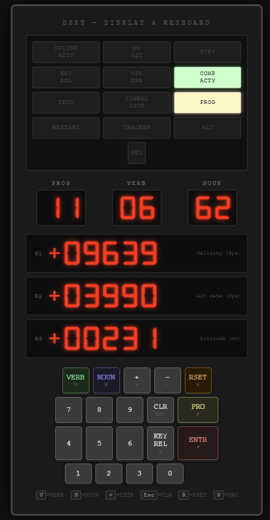

# Apollo Guidance Computer Simulator

An interactive, browser-based emulator of the Apollo 11 Guidance Computer — built directly from the original 1969 assembly source code in this repository.



---

## What This Is

The Apollo Guidance Computer (AGC) was a real-time embedded computer that guided the Apollo 11 Command Module (*Columbia*, Comanche 055) and Lunar Module (*Eagle*, Luminary 099) to the Moon and back in July 1969.

This simulator faithfully emulates:

- **The AGC CPU** — 15-bit ones-complement arithmetic, ~50 opcodes, 36 fixed-memory banks, 8 erasable banks, full register set (A, L, Q, Z, EB, FB, BB)
- **The DSKY** — Display & Keyboard unit with 7-segment displays, 12 warning lights, and the full 19-key keyboard with real key codes
- **The Executive** — Priority-based cooperative task scheduler (NOVAC / FINDVAC / WAITLIST)
- **The Interpretive Language** — Double-precision scalar and vector math (DLOAD, VXSC, VXV, UNIT, SQRT, SINE, COSINE…)
- **The complete Apollo 11 mission** — 15 flight phases from Pre-Launch to Splashdown, with real GET (Ground Elapsed Time) values

---

## Source Code Basis

The source code in this repository (`*.s` files) is the **original 1969 AGC assembly**, digitized from MIT Museum hardcopy printouts and reassembled with [yaYUL](http://www.ibiblio.org/apollo). The simulator interprets this code at the architectural level.

| Module | File | Purpose |
|---|---|---|
| Comanche 055 | CM files | Command Module guidance |
| Luminary 099 | LM files | Lunar Module guidance |
| `PINBALL_GAME_BUTTONS_AND_LIGHTS.s` | 98 KB | DSKY Verb/Noun display system |
| `INTERPRETER.s` | 77 KB | Interpretive language runtime |
| `EXECUTIVE.s` | — | Task scheduler |
| `LUNAR_LANDING_GUIDANCE_EQUATIONS.s` | — | Descent targeting |
| `CONIC_SUBROUTINES.s` | 47 KB | Orbital mechanics |

---

## Features

### DSKY (Display & Keyboard)
- Authentic 7-segment display rendering for PROG, VERB, NOUN, and three 5-digit signed registers (R1, R2, R3)
- 12 warning lights: UPLINK ACTY, NO ATT, STBY, KEY REL, OPR ERR, COMP ACTY, TEMP, GIMBAL LOCK, PROG, RESTART, TRACKER, ALT, VEL
- Full 19-key keyboard with real AGC key codes sent via I/O channel 015
- Real-time register label annotation (shows what R1/R2/R3 mean in each flight phase)
- Program alarm 1202 simulation during Powered Descent

### Flight Phase Jumper
Jump instantly to any of 15 historical mission events:

| Phase | GET |
|---|---|
| Pre-Launch | 000:00:00 |
| Lift-Off | 000:00:01 |
| Tower Jettison | 000:02:44 |
| SECO / Earth Orbit Insertion | 000:11:49 |
| Trans-Lunar Injection | 002:44:16 |
| Midcourse Correction 1 | 026:44:58 |
| Lunar Orbit Insertion | 075:49:50 |
| LM Undocking | 100:14:00 |
| Powered Descent Initiation (P63) | 101:36:14 |
| **1202 Program Alarm** | 102:33:05 |
| Touchdown | 102:45:40 |
| Ascent | 124:22:00 |
| Trans-Earth Injection | 135:23:42 |
| Entry Preparation | 194:49:13 |
| Splashdown | 195:18:35 |

### Guided Keystroke Timeline
Each flight phase includes a step-by-step guide showing:
- **What to press** — displayed as physical DSKY key sequences (e.g. `VERB` → `3` → `7` → `ENTR`)
- **Why** — the purpose of each command in context
- **Expected display** — what VERB/NOUN/PROG should show after input
- Auto-advancing steps for AGC-automatic events (no keypress needed)
- Manual "Mark Done & Next" for interactive steps

### Simulation Engine
- **Real-time accurate clock** — fractional tick accumulator ensures 1× speed = 1 real second per simulated second at any frame rate
- **Adjustable speed** — 1×, 5×, 30×, 60×, 300×, 900×
- **Sensor interpolation** — altitude, velocity, and other telemetry smoothly interpolated between mission keyframes with realistic noise
- **AGC CPU registers** — live octal display of A, L, Q, Z, EB, FB, BB, and cycle count

---

## Architecture

```
simulator/
├── index.html                  Main UI
├── css/
│   └── dsky.css                DSKY visual styles (7-segment, lights, keyboard)
└── js/
    ├── agc-core.js             AGC CPU emulator
    │                             · 15-bit ones-complement arithmetic
    │                             · ~50 opcodes (TC, CA, CS, AD, TS, MASK, INDEX…)
    │                             · Extended instruction set (DCA, SU, QXCH, LXCH…)
    │                             · Bank-switched memory (EB/FB/BB)
    │                             · Interrupt system (KEYRUPT, T3RUPT, RESUME)
    ├── dsky.js                 DSKY I/O module
    │                             · Channel 010/011/013/015 decode
    │                             · Verb/Noun/Prog 7-segment state
    │                             · 12 warning lights
    │                             · Keyboard → KEYRUPT1 interrupt
    ├── executive.js            Cooperative task scheduler
    │                             · NOVAC / FINDVAC job queuing
    │                             · Priority ordering
    │                             · WAITLIST timed callbacks
    ├── agc-interpreter.js      Interpretive language engine
    │                             · Scalar: DLOAD, DSTORE, DSU, DMP, DDIV, SQRT
    │                             · Vector: VLOAD, VADD, VSUB, VXSC, VXV, UNIT, ABVAL
    │                             · Trig: SINE, COSINE, ARCSIN, ARCCOS
    │                             · Stack: PUSH/PULL, SETPD
    └── main.js                 Simulation loop + UI controller
                                  · 15 flight phases with real GET timestamps
                                  · Guided keystroke steps per phase
                                  · Phase jump buttons
                                  · Fractional tick accumulator (real-time accuracy)
```

### AGC Hardware Reference

| Parameter | Value |
|---|---|
| Word size | 15 bits + 1 parity bit |
| Arithmetic | Ones-complement (no two's complement) |
| Clock | 1.024 MHz |
| Cycle time | ~11.7 µs (1 Machine Cycle Time = MCT) |
| Fixed memory | 36 banks × 1,024 words = 36,864 words (ROM) |
| Erasable memory | 8 banks × 256 words = 2,048 words (RAM) |
| I/O channels | 512 |
| Special registers | A, L, Q, EB, FB, Z, BB, ARUPT, LRUPT, QRUPT, ZRUPT, BBRUPT |
| Interrupts | KEYRUPT1, KEYRUPT2, UPRUPT, DOWNRUPT, T3RUPT, T4RUPT, T5RUPT, T6RUPT |

### I/O Channel Map (DSKY-relevant)

| Channel | Direction | Purpose |
|---|---|---|
| 010 (octal) | AGC → DSKY | 7-segment digit data (position + BCD) |
| 011 (octal) | AGC → DSKY | Warning light relay word |
| 013 (octal) | DSKY → AGC | Discrete inputs (blanked, standby) |
| 015 (octal) | Keyboard → AGC | Key code (5-bit) → KEYRUPT1 |
| 016 (octal) | Keyboard → AGC | Key code (5-bit) → KEYRUPT2 |

---

## How to Run

No build step required. Open directly in a browser:

```bash
# Clone the repo
git clone https://github.com/your-username/Apollo-11.git
cd Apollo-11/simulator

# Open in browser (any modern browser — no server needed)
open index.html
# or on Windows:
start index.html
```

Or serve locally for best font loading:

```bash
python -m http.server 8080
# then visit http://localhost:8080/simulator/
```

---

## Keyboard Shortcuts

| Key | DSKY Action |
|---|---|
| `V` | VERB |
| `N` | NOUN |
| `0`–`9` | Digit keys |
| `+` / `-` | Sign keys |
| `Enter` | ENTR |
| `Escape` | CLR |
| `R` | RSET |
| `P` | PRO |
| `K` | KEY REL |

### Example DSKY Inputs

```
V 3 7 N 0 0 ENTR    → Change to P00 (Idle)
V 0 6 N 6 2 ENTR    → Display orbital parameters
V 9 9 N 4 0 ENTR    → Please perform SPS burn (requires PRO)
V 0 5 N 0 9 ENTR    → Display alarm codes
RSET                 → Clear OPR ERR / RESTART lights
PRO                  → Proceed / confirm pending action
```

---

## Historical Context

### The 1202 Program Alarm
At T+102:33:05 during Powered Descent, the AGC triggered alarm **1202** (Executive Overflow — too many tasks queued). The guidance computer's Executive scheduler detected it was overloaded due to a rendezvous radar left powered on, stealing CPU cycles.

The AGC's design was robust enough to restart itself and recover within 1–2 seconds, discarding lower-priority tasks while preserving the critical guidance loop. Flight controller Jack Garman had pre-briefed the team that a 1202 alarm was "GO" — safe to continue.

Neil Armstrong manually overflew the planned landing site (a boulder field) using P66, touching down at 102:45:40 GET with 17 seconds of fuel remaining.

> *"Program alarm. It's a 1202."* — Buzz Aldrin
> *"We're GO on that alarm."* — Jack Garman / Steve Bales, Mission Control

This simulator replicates the 1202 alarm with the RESTART and OPR ERR lights, requiring the crew's RSET response.

### Software Credits (Original 1969)
- **Margaret Hamilton** — Lead software engineer, AGC flight software
- **MIT Instrumentation Laboratory** — Software development team
- **Raytheon** — DSKY hardware manufacturer
- **Ron Burkey & Virtual AGC Project** — Digitization and modern reassembly

---

## Related Resources

- [Virtual AGC Project](http://www.ibiblio.org/apollo/) — Full AGC emulator, documentation, ROM images
- [AGC Technical Manual](https://www.ibiblio.org/apollo/Documents/AgcBlockIITechMan.pdf) — Hardware reference
- [MIT AGC Source Transcription](http://www.ibiblio.org/apollo/ScansForConversion/Comanche055/) — Scanned hardcopy pages
- [Don Eyles — Sunburst and Luminary](http://www.doneyles.com/LM/Tales.html) — First-hand account from an AGC software engineer

---

## License

The AGC source code (`*.s` files) is **public domain** — released by NASA and the MIT Museum.
The simulator code (`simulator/`) is MIT licensed.
